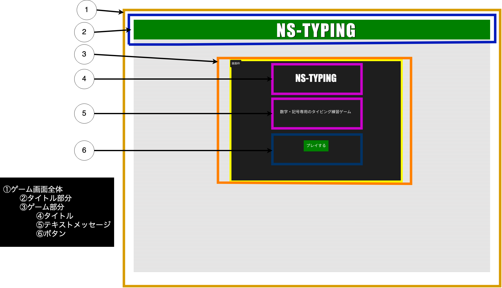
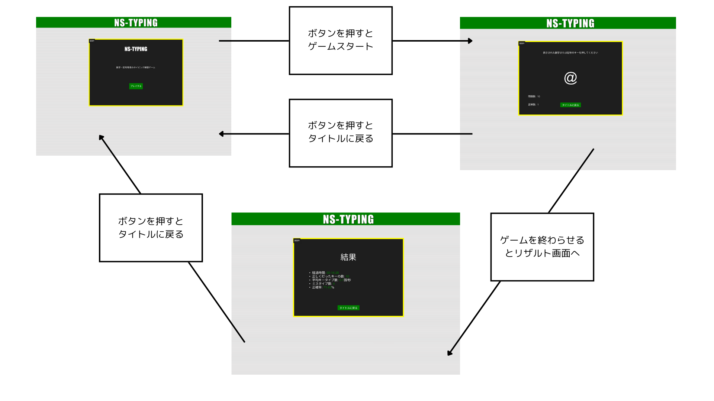

# Typing Game

## 概要
数字と記号のタイピングゲーム
経過時間、正しく打ったキーの数、平均キータイプ数、ミスタイプ数、正確率を記録

Reactを使用して作成

アルバイトの研修で作ったものなのでまだ改善の余地があります・・・

## UI

## アプリを作成
- フォルダ構造を整理
- 直接gameやresultへのアクセスを禁止
- TSに変更
- Startコンポーネントの実装
    - 基本的なレイアウトを作成
    - Gameコンポーネントへ遷移する機能を実装
- Gameコンポーネントの実装
    - 基本的なレイアウトを作成
    - Startコンポーネントへ遷移する機能を実装
    - データをカウントする機能を実装
- Resultコンポーネントの実装
    - 基本的なレイアウトを作成
    - Startコンポーネントへ遷移する機能を実装
    - カウントしたデータを表示する機能を実装